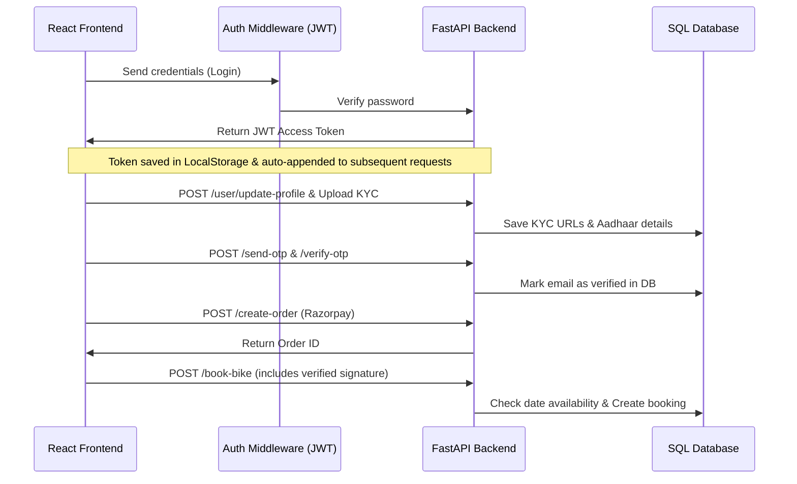

# 🏍 Bike Rental System - Complete Project Analysis & Roadmap

This comprehensive analysis report outlines the project architecture, tech stack, active bugs/issues, missing features, and a step-by-step roadmap to elevate the project to a premium production-ready standard.

---

## 1. Project Overview & Architecture

The **Bike Rental System** is a full-stack web application designed to allow users to rent premium motorcycles for daily or hourly durations, complete their profile verification via email OTP and KYC document uploads, and complete secure payments via Razorpay.

### Technical Stack
* **Frontend**: React (Hooks, Context API for authentication state, Axios client with automatic request interceptors for Authorization headers).
* **Backend**: FastAPI (Python), SQLAlchemy ORM, SQLite/PostgreSQL Database, Pydantic for data validation.
* **Payment Gateway**: Razorpay (Web SDK + backend order creation and verification).
* **Notification System**: FastAPI-Mail (SMTP SMTP server integration for sending verification OTPs).
* **Document Uploads**: Multipart local uploads to the server under `uploads/` for KYC.
* **Document Generation**: `jsPDF` and `jspdf-autotable` on the frontend for generating dynamic, premium PDF receipts.

### System Architecture Flow


---

## 2. Identified Bugs & Vulnerabilities (Critical Issues)

These are active bugs and security gaps in the current code that must be resolved to ensure reliability and secure operation:

### 🚨 1. Admin Endpoint Access Gaps (Critical Security Bug)
* **Location**: `backend/routes/bike_routes.py`
* **Issue**: Endpoints like `/add-bike`, `/update-bike/{bike_id}`, and `/delete-bike/{bike_id}` do **not** verify if the authenticated user has the `"admin"` role! Any registered user can manually send raw POST/PUT/DELETE requests to add, modify, or delete bikes.
* **Fix**: Create and apply an `admin_required` dependency wrapper that checks if `current_user.role == 'admin'` before allowing access.

### 🚨 2. Price Tampering Vulnerability (Critical Financial Bug)
* **Location**: `backend/routes/booking_routes.py`
* **Issue**: The server-side `/book-bike` route trusts the `total_price` provided directly from the frontend request body (`booking.total_price`). A malicious user could alter the network payload to pay ₹1 instead of ₹1100.
* **Fix**: Re-calculate the rental cost on the server-side based on the bike's hourly/daily price in the database and the booking start/end dates. Reject the request if the payment verification does not match this computed price.

### 🐛 3. Global vs. Date-Range Bike Availability Mismatch (Logic Bug)
* **Location**: `backend/routes/booking_routes.py`
* **Issue**: While the backend checks for overlapping dates during a new booking, it also sets `bike.availability = "Booked"`. If a bike is marked as `"Booked"`, it will fail the global availability check for any other user, even if they try to rent it for non-overlapping future dates.
* **Fix**: Eliminate the hardcoded global `availability` status for future bookings. A bike's availability should be computed dynamically per date range by checking if there is any active, overlapping booking row.

### 🐛 4. Cancellation Availability Reopening Override (Logic Bug)
* **Location**: `backend/routes/booking_routes.py`
* **Issue**: When a booking is cancelled, the route automatically sets the bike's availability back to `"Available"`. This ignores the fact that there might be *other* upcoming active bookings for the same bike, immediately making it globally available.
* **Fix**: Remove global state overrides on cancellation. Let the dynamic overlapping query handle availability.

---

## 3. What is Missing in this Project?

To build a premium, commercial-grade product, the following essential modules are currently missing:

### 🛡 A. Advanced Admin Management Panel
* **Missing Details**: The admin currently has limited oversight of users and transactions. 
* **Required Features**:
  - A user management panel showing list of users, their KYC documents, and button to toggle verification status.
  - Interactive financial ledger showing Razorpay transaction details, refund triggers, and aggregate revenue.

### 📅 B. Dynamic Calendar Booking View
* **Missing Details**: Users currently type dates into manual fields. They cannot see when a bike is already booked.
* **Required Features**:
  - A premium interactive calendar (like `react-calendar` or custom grid) in the Booking Modal that highlights blocked dates in red and open dates in green.

### 💬 C. Review & Rating System
* **Missing Details**: No feedback loop or user-generated content is supported.
* **Required Features**:
  - Users should be able to rate a bike (1-5 stars) and write comments after their booking trip is completed.
  - Show average ratings on the homepage bike cards.

### 🔔 D. Real-Time Notifications
* **Missing Details**: Email verification works via OTP, but there is no booking confirmation email, trip reminder, or invoice copy sent to their inbox.
* **Required Features**:
  - Automatically email the generated PDF invoice to the user's verified email on successful payment.
  - Integration with Twilio/SMS or WhatsApp API for real-time mobile confirmations.

---

## 4. Step-by-Step Implementation Roadmap (Marathi/Hindi Mix Guidelines)

He features aani bugs solve karnyasathi khalil **Step-by-Step Roadmap** follow kara. He ekdam simple bhashet explained aahe:

---

### Step 1: Secure Admin Endpoints (सर्वात आधी Security Gaps बंद करा)
**Goal**: Admin features ला secure करा जेणेकरून regular युजर्स बाईक्स डिलीट किंवा ऍड करू शकणार नाहीत.

1. `backend/routes/admin_deps.py` फाईल तपासा. तिथे `get_current_admin` नावाची डिपेंडन्सी तयार करा:
   ```python
   from fastapi import Depends, HTTPException, status
   from auth.auth_handler import verify_token
   from models.user_model import User
   from database.database import get_db
   from sqlalchemy.orm import Session

   def get_current_admin(email: str = Depends(verify_token), db: Session = Depends(get_db)):
       user = db.query(User).filter(User.email == email).first()
       if not user or user.role != "admin":
           raise HTTPException(
               status_code=status.HTTP_403_FORBIDDEN,
               detail="Only administrators are authorized to perform this action"
           )
       return user
   ```
2. आता `backend/routes/bike_routes.py` मध्ये जा आणि `add_bike`, `update_bike`, आणि `delete_bike` च्या endpoints मध्ये ही dependency ऍड करा:
   ```python
   from routes.admin_deps import get_current_admin

   @router.post("/add-bike")
   def add_bike(
       bike: BikeCreate,
       db: Session = Depends(get_db),
       admin: User = Depends(get_current_admin) # Protected!
   ):
       ...
   ```

---

### Step 2: Prevent Price Tampering (पैशांची फसवणूक थांबवा)
**Goal**: Frontend मधून येणारी प्राईस डायरेक्ट ट्रस्ट करू नका. Server वर recalculate करा.

1. `backend/routes/booking_routes.py` मध्ये `book_bike` फंक्शन ओपन करा.
2. Booking schema मधून येणाऱ्या `total_price` ला database मधील बाईकच्या `price_per_day` किंवा `price_per_hour` नुसार क्रॉस-व्हेरिफाय करा:
   ```python
   # Calculate duration mathematically
   start_date = datetime.strptime(booking.booking_date.split(' ')[0], "%Y-%m-%d")
   end_date = datetime.strptime(booking.return_date.split(' ')[0], "%Y-%m-%d")
   days = (end_date - start_date).days
   expected_price = days * bike.price_per_day

   if booking.total_price != expected_price:
       raise HTTPException(status_code=400, detail="Invalid booking amount detected. Price tampering attempt rejected.")
   ```

---

### Step 3: Implement Dynamic Date-Range Availability (Availability Logic सुधारा)
**Goal**: बाईक एकदा बुक झाली म्हणजे ती कायमची block होऊ नये, फक्त त्या specific तारखांसाठीच block व्हावी.

1. `book_bike` मधून `bike.availability = "Booked"` ही लाईन काढून टाका.
2. नवीन बुकिंग करताना खालीलप्रमाणे overlapping query लावा:
   ```python
   overlapping_bookings = db.query(Booking).filter(
       Booking.bike_name == booking.bike_name,
       Booking.status != "Cancelled",
       # Overlap condition check
       Booking.booking_date <= booking.return_date,
       Booking.return_date >= booking.booking_date
   ).first()

   if overlapping_bookings:
       raise HTTPException(status_code=400, detail="This bike is already reserved for the selected date range.")
   ```

---

### Step 4: Add Calendar & Interactive spec filters in Frontend (नवीन युजर-फ्रेंडली फीचर्स ऍड करा)
**Goal**: UI मध्ये कॅलेंडर आणि रेटिंग्स दाखवणे.

1. **Calendar Blockouts**: React frontend मध्ये `react-datepicker` किंवा `react-calendar` install करा:
   ```bash
   npm install react-datepicker
   ```
2. `BookingModal.js` मध्ये standard inputs काढून `DatePicker` वापरा जेथे `excludeDates` array मध्ये backend मधून आणलेले आधीचे active bookings चे dates block केलेले असतील.
3. **Rating System**:
   - Database मध्ये `reviews` नावाचा नवीन table तयार करा (columns: `id`, `user_email`, `bike_name`, `rating`, `comment`, `created_at`).
   - `auth_routes.py` मध्ये `/add-review` endpoint ऍड करा.
   - `BikeDetailsModal.js` मध्ये युजर्सचे feedback stars दाखवण्यासाठी layout सुधारा.

---

### Step 5: Email PDF Invoices (बुकिंगनंतर ऑटोमॅटिक ई-मेल बिल पाठवा)
**Goal**: युजरला पेमेंट सक्सेसफुल झाल्यावर ई-मेल वर PDF रीसीट पाठवणे.

1. `backend/routes/booking_routes.py` मध्ये `FastMail` integration सुधारा.
2. जेव्हा `book_bike` सक्सेस होईल, तेव्हा PDF च्या details SMTP द्वारे युजरला पाठवा जेणेकरून युजर्सच्या इनबॉक्समध्ये त्यांची transaction details पोहोचतील.

---
*Report compiled successfully. Follow this step-by-step roadmap to make your Bike Rental System extremely robust and secure!*
